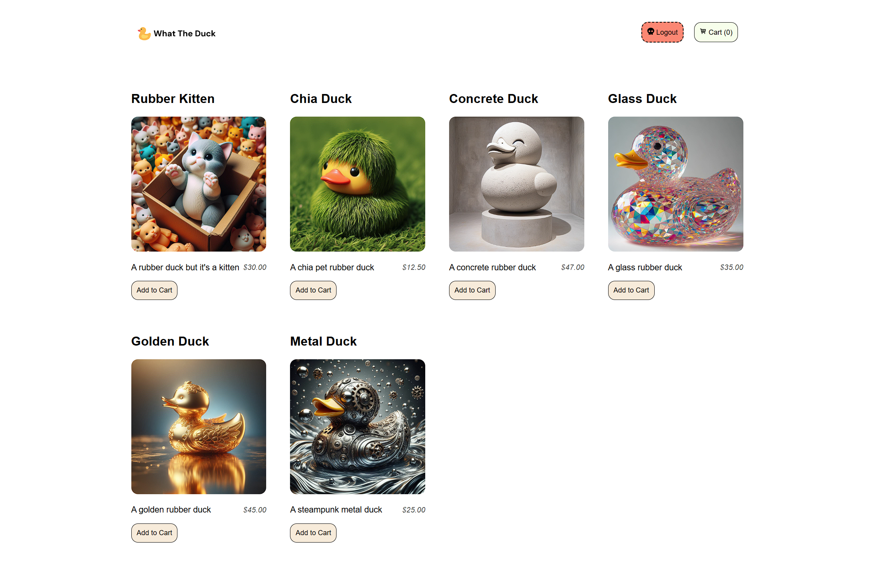

# What The Duck — Online Rubber Duck Store



## About the Project

_What The Duck_ is a lightweight, React-based e-commerce platform designed as part of a school project. It showcases modern web development practices and integrates with Stripe for secure payment processing.

### Key Features

- **React Frontend**: Utilizes React for a dynamic and responsive user interface.
- **Express Backend**: Powered by an Express.js server for efficient API handling.
- **Stripe Integration**: All products are fetched directly from Stripe, ensuring real-time inventory and pricing.
- **Secure Checkout**: Implements Stripe Checkout for a smooth and secure payment process.
- **User Authentication**: Simple user registration and login system with data stored in a local JSON file.
- **Order Tracking**: Successful orders are saved to `orders.json` after payment confirmation.

## Project Requirements

This project fulfills the following key requirements:

1. **Stripe Product Integration**: All products are dynamically fetched from Stripe.
2. **Shopping Cart Functionality**: Users can add products to their cart and modify quantities.
3. **Stripe Checkout**: Secure checkout process using Stripe's test cards. [Stripe Test Cards](https://stripe.com/docs/testing#cards)
4. **User Management**: Local user creation and authentication.
5. **Locally stored orders**: Successful orders are saved locally in `orders.json`.
6. **Input Validation**: Implements server-side validation for user inputs.
7. **Error Handling**: Graceful 🙄 error handling on both client and server sides.

## Getting Started

Follow these steps to set up the project locally:

1. Make sure you have Node.js installed.
2. Clone the repository
3. Install dependencies for both server (root) and client folder:

   ```
   npm install
   ```

4. Use the `.env` file in the root directory to add your Stripe API keys:

   ```
   STRIPE_SECRET_KEY=your_stripe_secret_key
   STRIPE_WEBHOOK_SECRET=your_stripe_webhook_secret
   ```

5. Start the server:

   ```
   node server
   ```

6. In a new terminal, start the React application:

   ```
   cd client
   npm start
   ```

7. Open your browser and navigate to `http://localhost:3000` to view the application.

## Testing

To test the checkout process, use Stripe's test cards. A common test card number is `4242 4242 4242 4242` with any future expiry date and any CVC.

---

Happy rubber duck shopping! 🛒🦆
